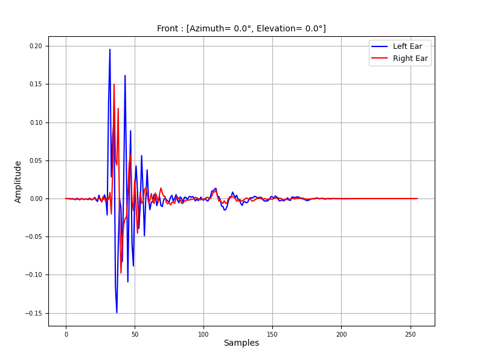
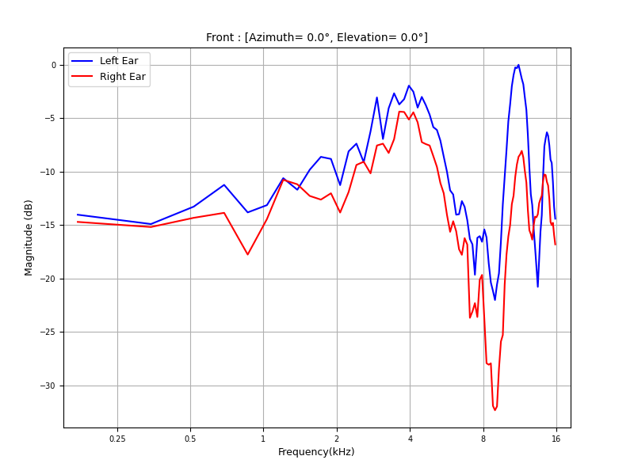
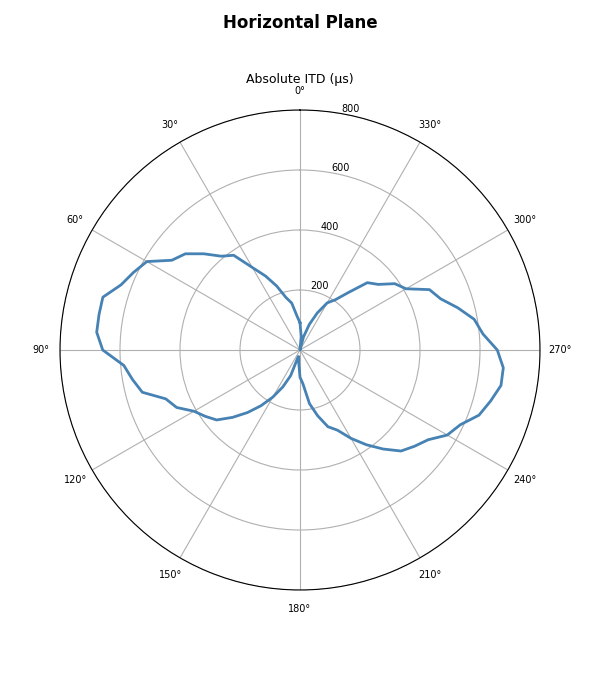
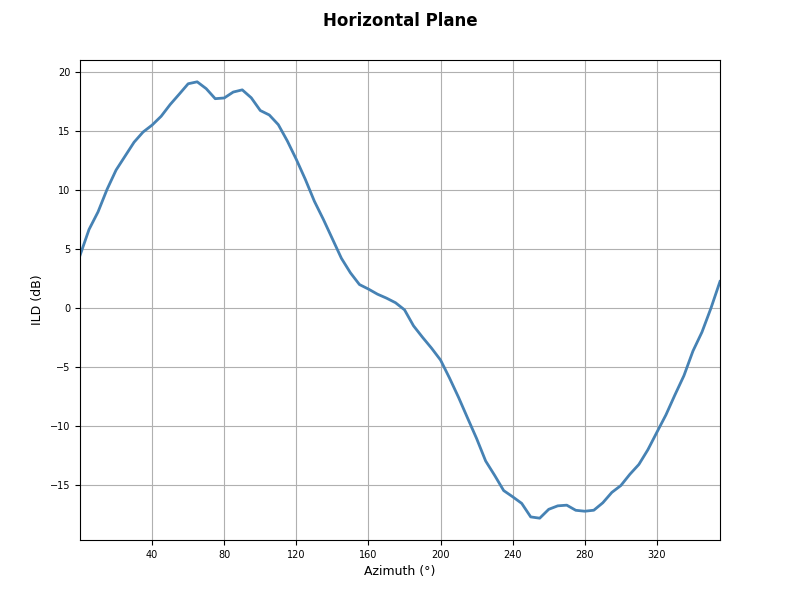
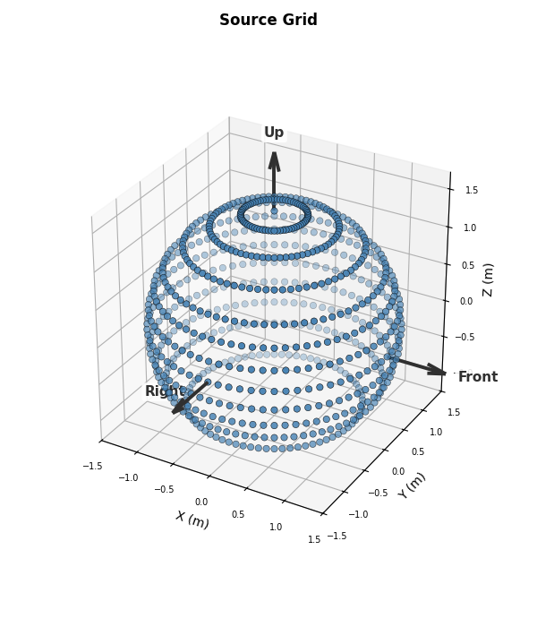
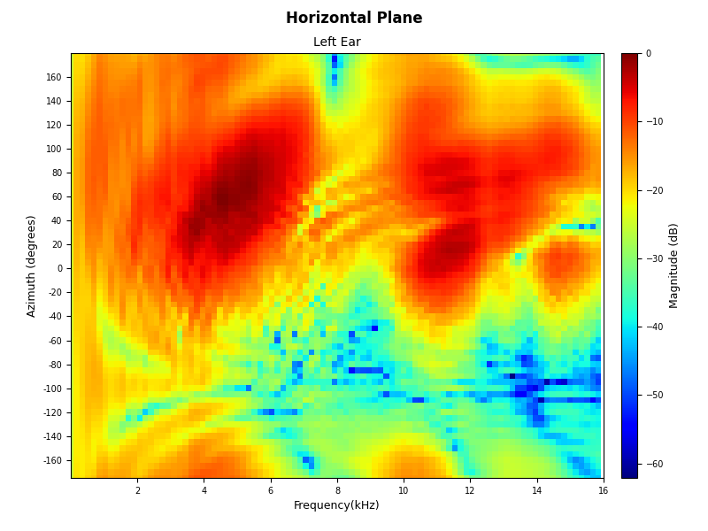
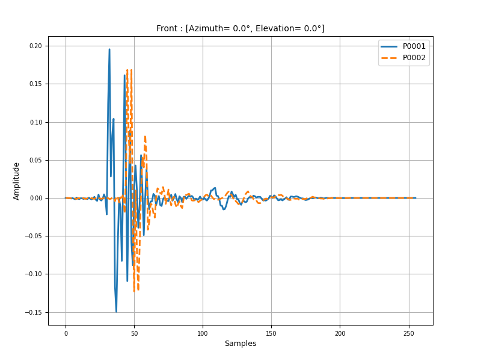
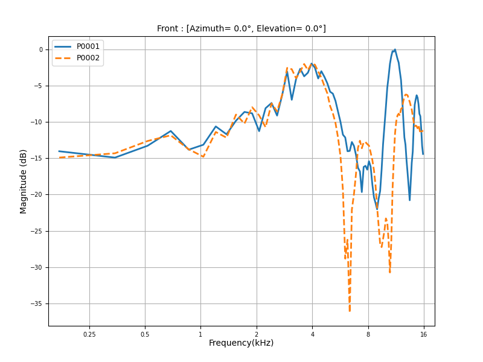
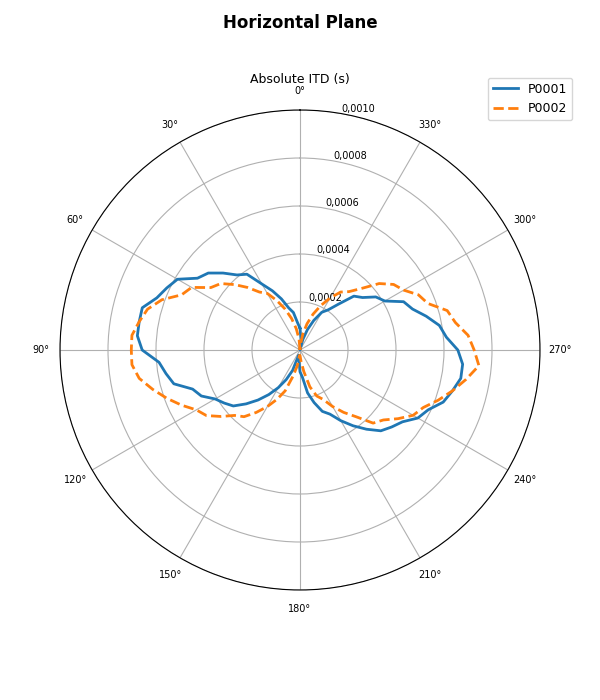
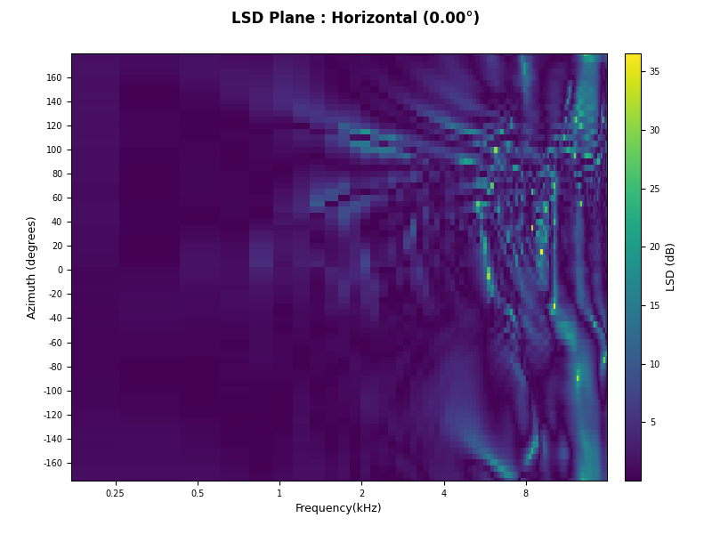

Quick Start
===========

Installation
------------

The recommended and straightforward installation is:

.. code-block:: bash

   pip install hrtfpykit

For local installation from source:

.. code-block:: bash

   git clone https://github.com/ArielAlvarez-Martinez/hrtfpykit.git
   cd hrtfpykit
   pip install .

For local development from source:

.. code-block:: bash

   git clone https://github.com/ArielAlvarez-Martinez/hrtfpykit.git
   cd hrtfpykit
   pip install -e ".[test,docs]"

``hrtfpykit`` requires Python 3.13 or newer.

Main imports
------------

These imports cover the main hrtfpykit workflows: SOFA loading, HRTF objects,
spherical harmonics, comparison plots, reconstruction plots, dataset classes,
dataset specs, and batching utilities.

.. code-block:: python

   from hrtfpykit.sofa import load_sofa

   from hrtfpykit.hrtf import load_hrtf
   from hrtfpykit.hrtf import SH, sht, sht_inverse, sht_error
   
   from hrtfpykit.plots import compare_amplitude, compare_magnitude, compare_absolute_itd, compare_lsd_plane
   from hrtfpykit.plots import sht_reconstruction_comparison, sht_reconstruction_error
   
   from hrtfpykit.datasets import HUTUBS, SONICOM
   from hrtfpykit.datasets import HRTFSpec, ITDSpec, ImageSpec, collate_samples

hrtfpykit.sofa: Working with SOFA files
---------------------------------------

The :doc:`sofa API</sofa/index>` is the file structure layer of hrtfpykit. It
represents dimensions, variables, metadata, conventions, and raw stored values as
structured Python objects. HRTF objects, plots, and dataset pipelines build on
this layer when they need SOFA-backed data, while the same layer can inspect and
edit the stable SOFA conventions registered in hrtfpykit.

.. code-block:: python

   import numpy as np

   from hrtfpykit.sofa import load_sofa

   # Load SOFA file
   sofa = load_sofa("subject_001.sofa")

   # SOFA file summary
   print(sofa.summary())

   # Access SOFA file metadata
   print(sofa.GlobalAttributes.get("SOFAConventions").value)
   print(sofa.Dimensions.get_names())
   print(sofa.Variables.get_names())

   # Access SOFA file data
   source_positions = sofa.Variables.get("SourcePosition").value
   print(source_positions.shape)

   if "Data.IR" in sofa.Variables.get_names():
       ir = sofa.Variables.get("Data.IR").value
       print(ir.shape)

   # Modify SOFA data on a clone
   editable = sofa.clone()
   editable.create_global_attribute("ExampleNote", "edited with hrtfpykit")

   if "Data.IR" in editable.Variables.get_names():
       edited_ir = np.array(editable.Variables.get("Data.IR").value, copy=True)
       edited_ir[..., :8] = 0.0
       editable.modify_variable("Data.IR", edited_ir)

   # Save SOFA file
   saved_path = editable.save("subject_001_edited.sofa", overwrite=True)
   print(saved_path)

hrtfpykit.hrtf: Handling HRTF objects
-------------------------------------

The :doc:`hrtf API </hrtf/index>` is the HRTF object layer for SOFA files
that follow the ``SimpleFreeFieldHRIR`` or ``SimpleFreeFieldHRTF`` conventions.
It loads those files through the SOFA API and keeps IR data, TF data, source
positions, and the backed SOFA object synchronized. Selection and transform
methods return new HRTF objects, leaving the original state available for
inspection, comparison, reset, plotting, metrics, and save workflows.

.. code-block:: python

   from hrtfpykit.hrtf import load_hrtf

   # Load HRTF file
   hrtf = load_hrtf("subject_001.sofa")

   # Access SOFA backed object
   sofa = hrtf.Sofa
   print(sofa.summary())

   # Inspect HRTF metadata
   print(hrtf.SOFAConventions)
   print(hrtf.fft_length)

   # Inspect time domain data
   print(hrtf.IR.values.shape)
   print(hrtf.IR.sample_rate)
   print(hrtf.IR.ir_length)
   print(hrtf.IR.ir_duration)

   # Inspect frequency domain data
   print(hrtf.TF.values.shape)
   print(hrtf.TF.frequency_bins.shape)
   print(hrtf.TF.min_frequency_bin)
   print(hrtf.TF.max_frequency_bin)

   # Inspect source positions
   print(hrtf.Sources.get_positions().shape)
   print(hrtf.Sources.get_azimuth_angles())
   print(hrtf.Sources.get_elevation_angles())

   # Create a selected HRTF copy
   selected = hrtf.select(
       positions=["front", "left", "right"],
       ear="both",
       start=0,
       end=128,
   )

   # Create a modified HRTF copy
   windowed = selected.transform.apply_window("hann")
   print(hrtf.is_transformed())
   print(windowed.is_transformed())

   # Synchronize current HRTF data into its SOFA object
   windowed.update_sofa(
       change_sofa_dimensions=True,
       sofa_convention="SimpleFreeFieldHRIR",
   )

   # Reset in-memory data from the backed SOFA object
   restored = windowed.reset()

   # Save HRTF file
   saved_path = restored.save(
       "subject_001_selected_windowed.sofa",
       overwrite=True,
       change_sofa_dimensions=True,
       sofa_convention="SimpleFreeFieldHRIR",
   )

   print(saved_path)

hrtfpykit.plots: Visualizing HRTF data
--------------------------------------

The :doc:`plots API </plots/index>` is the visualization layer of hrtfpykit.
It turns HRTF object states and comparison data into figures for source grids,
HRIR amplitude, HRTF magnitude, spectral cues, ITD and ILD cues, spatial planes,
and differences between HRTFs. Plots sit after loading, selection, transforms,
metrics, or model evaluation, so each figure reflects the exact HRTF state being
inspected.

There are two plotting surfaces: built in methods of the
:class:`hrtfpykit.hrtf.HRTF` object for visualizing one loaded HRTF state, and
comparison functions for working with multiple HRTFs.

HRTF plots
~~~~~~~~~~

HRTF plots are built in methods of the :class:`hrtfpykit.hrtf.HRTF` object.
They use the current IR, TF, and source position state, so selections and
transforms are reflected in the generated figures.

:meth:`~hrtfpykit.plots.hrtf.HRTFPlots.plot_amplitude`
^^^^^^^^^^^^^^^^^^^^^^^^^^^^^^^^^^^^^^^^^^^^^^^^^^^^^^^^

.. code-block:: python

   from hrtfpykit.hrtf import load_hrtf

   hrtf = load_hrtf("hrtfs/P0001_FreeFieldComp_44kHz.sofa")
   hrtf.plot_amplitude(
       positions="front",
       ear="both",
       x_axis="samples",
   )

|

:meth:`~hrtfpykit.plots.hrtf.HRTFPlots.plot_magnitude`
^^^^^^^^^^^^^^^^^^^^^^^^^^^^^^^^^^^^^^^^^^^^^^^^^^^^^^^^

.. code-block:: python

   from hrtfpykit.hrtf import load_hrtf

   hrtf = load_hrtf("hrtfs/P0001_FreeFieldComp_44kHz.sofa")
   hrtf.plot_magnitude(
       positions="front",
       x_axis="log",
       ear="both",
       reference="max",
       freq_max=16000.0,
   )

|

:meth:`~hrtfpykit.plots.hrtf.HRTFPlots.plot_absolute_itd`
^^^^^^^^^^^^^^^^^^^^^^^^^^^^^^^^^^^^^^^^^^^^^^^^^^^^^^^^^^

.. code-block:: python

   from hrtfpykit.hrtf import load_hrtf

   hrtf = load_hrtf("hrtfs/P0001_FreeFieldComp_44kHz.sofa")
   hrtf.plot_absolute_itd(elevation_angle=0.0)

|

:meth:`~hrtfpykit.plots.hrtf.HRTFPlots.plot_ild_curve`
^^^^^^^^^^^^^^^^^^^^^^^^^^^^^^^^^^^^^^^^^^^^^^^^^^^^^^^^

.. code-block:: python

   from hrtfpykit.hrtf import load_hrtf

   hrtf = load_hrtf("hrtfs/P0001_FreeFieldComp_44kHz.sofa")
   hrtf.plot_ild_curve(elevation_angle=0.0)

|

:meth:`~hrtfpykit.plots.hrtf.HRTFPlots.plot_source_grid`
^^^^^^^^^^^^^^^^^^^^^^^^^^^^^^^^^^^^^^^^^^^^^^^^^^^^^^^^^

.. code-block:: python

   from hrtfpykit.hrtf import load_hrtf

   hrtf = load_hrtf("hrtfs/P0001_FreeFieldComp_44kHz.sofa")
   hrtf.plot_source_grid()

|

:meth:`~hrtfpykit.plots.hrtf.HRTFPlots.plot_spectrum_plane`
^^^^^^^^^^^^^^^^^^^^^^^^^^^^^^^^^^^^^^^^^^^^^^^^^^^^^^^^^^^^

.. code-block:: python

   from hrtfpykit.hrtf import load_hrtf

   hrtf = load_hrtf("hrtfs/P0001_FreeFieldComp_44kHz.sofa")
   hrtf.plot_spectrum_plane(
       plane="horizontal",
       elevation_angle=0.0,
       x_axis="linear",
       ear="left",
       freq_max=16000.0,
   )

|

Comparison plots
~~~~~~~~~~~~~~~~

Comparison plots put multiple HRTFs into the same visual frame. They can overlay
HRIR waveforms, HRTF magnitude responses, ITD and ILD cue curves, and LSD maps
over a source grid or spatial plane. The comparison stays tied to the selected
position, ear, frequency range, or plane, so differences are shown in the
acoustic view where they appear.

:func:`~hrtfpykit.plots.compare_amplitude`
^^^^^^^^^^^^^^^^^^^^^^^^^^^^^^^^^^^^^^^^^^

.. code-block:: python

   from hrtfpykit.hrtf import load_hrtf
   from hrtfpykit.plots import compare_amplitude

   hrtf_a = load_hrtf("hrtfs/P0001_FreeFieldComp_44kHz.sofa")
   hrtf_b = load_hrtf("hrtfs/P0002_FreeFieldComp_44kHz.sofa")
   compare_amplitude(
       [hrtf_a, hrtf_b],
       positions="front",
       ear="left",
       x_axis="samples",
       legends=["P0001", "P0002"],
       line_styles=["-", "--"],
   )

|

:func:`~hrtfpykit.plots.compare_magnitude`
^^^^^^^^^^^^^^^^^^^^^^^^^^^^^^^^^^^^^^^^^^

.. code-block:: python

   from hrtfpykit.hrtf import load_hrtf
   from hrtfpykit.plots import compare_magnitude

   hrtf_a = load_hrtf("hrtfs/P0001_FreeFieldComp_44kHz.sofa")
   hrtf_b = load_hrtf("hrtfs/P0002_FreeFieldComp_44kHz.sofa")
   compare_magnitude(
       [hrtf_a, hrtf_b],
       positions="front",
       ear="left",
       x_axis="log",
       unit="db",
       reference="max",
       legends=["P0001", "P0002"],
       line_styles=["-", "--"],
       freq_max=16000.0,
   )

|

:func:`~hrtfpykit.plots.compare_absolute_itd`
^^^^^^^^^^^^^^^^^^^^^^^^^^^^^^^^^^^^^^^^^^^^^

.. code-block:: python

   from hrtfpykit.hrtf import load_hrtf
   from hrtfpykit.plots import compare_absolute_itd

   hrtf_a = load_hrtf("hrtfs/P0001_FreeFieldComp_44kHz.sofa")
   hrtf_b = load_hrtf("hrtfs/P0002_FreeFieldComp_44kHz.sofa")
   compare_absolute_itd(
       [hrtf_a, hrtf_b],
       elevation_angle=0.0,
       legends=["P0001", "P0002"],
       line_styles=["-", "--"],
   )

|

:func:`~hrtfpykit.plots.compare_lsd_plane`
^^^^^^^^^^^^^^^^^^^^^^^^^^^^^^^^^^^^^^^^^^

.. code-block:: python

   from hrtfpykit.hrtf import load_hrtf
   from hrtfpykit.plots import compare_lsd_plane

   hrtf_a = load_hrtf("hrtfs/P0001_FreeFieldComp_44kHz.sofa")
   hrtf_b = load_hrtf("hrtfs/P0002_FreeFieldComp_44kHz.sofa")
   compare_lsd_plane(
       hrtf_a,
       hrtf_b,
       plane="horizontal",
       ear="right",
       elevation=0.0,
       x_axis="log",
       freq_max=16000.0,
       colormap="viridis",
   )

|

hrtfpykit.datasets: Building dataset pipelines
----------------------------------------------

The :doc:`datasets API </datasets/index>` is the dataset construction layer
for public HRTF resources. Dataset objects are configured with
:doc:`specs </datasets/specs>`, which declare the acoustic values, cue
metrics, and subject resources exposed as sample inputs and targets. The same
pattern can align HRTFs with anthropometry, metadata, meshes, images, videos, or
other available resources, then read one sample directly or batch samples for
PyTorch with :func:`hrtfpykit.datasets.collate_samples`.

.. code-block:: python

   from torch.utils.data import DataLoader
   from hrtfpykit.datasets import HUTUBS, HRTFSpec, ILDSpec, ITDSpec, collate_samples

   dataset = HUTUBS(
       root="datasets/hutubs",
       inputs=HRTFSpec(
           domain="frequency",
           signal="tf_magnitude_db",
           ears="left",
           index_by=("subject", "position"),
           position_index=True,
           name="magnitude_db",
       ),
       target=(
           ITDSpec(
               index_by=("subject", "position"),
               output="samples",
               name="itd",
           ),
           ILDSpec(
               index_by=("subject", "position"),
               mode="broad-band",
               name="ild",
           ),
       ),
       split="train",
   )

   # Read one sample
   sample = dataset[0]

   print(sample["inputs"].keys())
   print(sample["target"].keys())

   # Batch samples for PyTorch
   loader = DataLoader(dataset, batch_size=8, collate_fn=collate_samples)
   batch = next(iter(loader))

   print(batch["inputs"].keys())
   print(batch["target"].keys())

Where to go next
----------------

- :doc:`sofa/index` for file level SOFA workflows.
- :doc:`hrtf/index` for HRTF objects, transforms, metrics, and spherical harmonics.
- :doc:`plots/index` for HRTF plots and comparison plots.
- :doc:`datasets/index` for public dataset pipelines and sample specs.
- :doc:`tutorials/index` for guided examples.
- :doc:`tests` for the test suite and local validation workflow.
