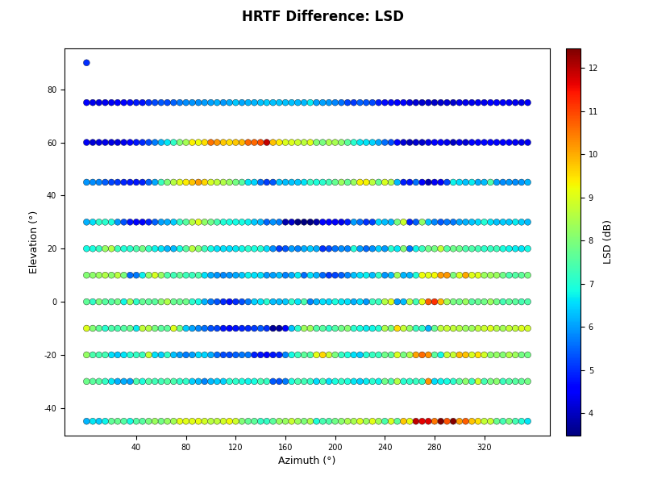
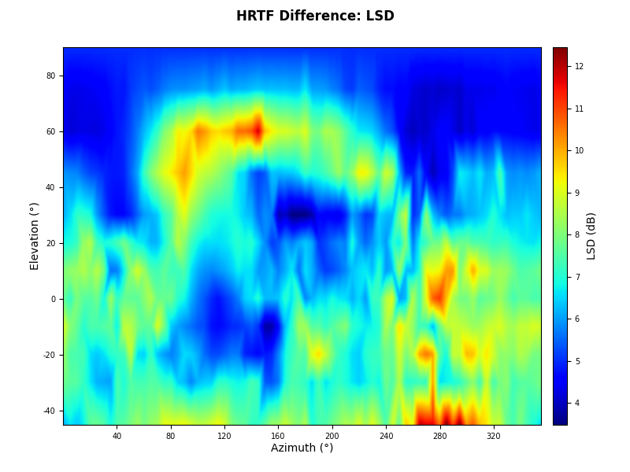

Quick Start
===========

Installation
------------

The recommended and straightforward installation is:

``hrtfpykit`` requires Python 3.12 or newer.

.. code-block:: bash

   pip install hrtfpykit

For local installation from source:

.. code-block:: bash

   git clone https://github.com/ArielAlvarez-Martinez/hrtfpykit.git
   cd hrtfpykit
   pip install .

For local development from source:

.. code-block:: bash

   git clone https://github.com/ArielAlvarez-Martinez/hrtfpykit.git
   cd hrtfpykit
   pip install -e ".[test,docs]"

Main imports
------------

These imports cover the main hrtfpykit workflows: SOFA loading, HRTF objects,
spherical harmonics, comparison plots, reconstruction plots, dataset classes,
dataset specs, and batching utilities.

.. code-block:: python

   from hrtfpykit.sofa import load_sofa

   from hrtfpykit.hrtf import load_hrtf
   from hrtfpykit.hrtf import SH, sht, sht_inverse, sht_error
   
   from hrtfpykit.plots import plot_amplitude, plot_magnitude, plot_absolute_itd, plot_ild
   from hrtfpykit.plots import plot_source_grid, plot_spectrum_plane
   from hrtfpykit.plots import compare_amplitude, compare_magnitude, compare_absolute_itd, compare_hrtf_difference
   from hrtfpykit.plots import sht_reconstruction_comparison, sht_reconstruction_error
   
   from hrtfpykit.datasets import HUTUBS, SONICOM
   from hrtfpykit.datasets import HRTFSpec, ITDSpec, ImageSpec, collate_samples

Download Two SONICOM Example HRTFs
----------------------------------

The examples below use the first two public SONICOM subjects. Run this setup
once to download the measured 44.1 kHz FreeFieldComp HRTF resources for
``P0001`` and ``P0002`` and store their local paths.

.. code-block:: python

   from pathlib import Path

   from hrtfpykit.datasets import SONICOM

   root = Path("datasets/sonicom")

   # Keep the example small: use only P0001 and P0002.
   selected_subject_ids = ("P0001", "P0002")

   # Download only the measured 44.1 kHz FreeFieldComp HRTF resources for P0001 and P0002.
   SONICOM(
       root=root,
       download=True,
       download_resources="hrtf",
       download_hrtf_variant={
           "type": "measured",
           "sample_rate": 44100,
           "version": "FreeFieldComp",
       },
       download_subject_ids=selected_subject_ids,
       subject_ids=selected_subject_ids,
       verify_checksum=True,
   )

   hrtf_path_a = (
       root
       / "P0001"
       / "HRTF"
       / "HRTF"
       / "44kHz"
       / "P0001_FreeFieldComp_44kHz.sofa"
   )
   hrtf_path_b = (
       root
       / "P0002"
       / "HRTF"
       / "HRTF"
       / "44kHz"
       / "P0002_FreeFieldComp_44kHz.sofa"
   )

hrtfpykit.sofa: Working with SOFA files
---------------------------------------

The :doc:`sofa API </sofa/index>` is hrtfpykit's interface to the SOFA file
structure. It exposes dimensions, variables, global attributes, convention
metadata, and stored arrays as Python objects. The example below loads a file,
checks its metadata and source positions, reads HRIR data, edits a cloned SOFA
object, and writes the edited file. For a longer guide to SOFA inspection,
editing, validation, and saving, see
:doc:`Starting with hrtfpykit.sofa </tutorials/starting_with_hrtfpykit_sofa>`.

.. code-block:: python

   import numpy as np

   from hrtfpykit.sofa import load_sofa

   # Load SOFA file
   sofa = load_sofa(hrtf_path_a)

   # SOFA file summary
   print(sofa.summary())

   # Access SOFA file metadata
   print(sofa.GlobalAttributes.get("SOFAConventions").value)
   print(sofa.Dimensions.get_names())
   print(sofa.Variables.get_names())

   # Access SOFA file data
   source_positions = sofa.Variables.get("SourcePosition").value
   print(source_positions.shape)

   if "Data.IR" in sofa.Variables.get_names():
       ir = sofa.Variables.get("Data.IR").value
       print(ir.shape)

   # Modify SOFA data on a clone
   editable = sofa.clone()
   editable.create_global_attribute("ExampleNote", "edited with hrtfpykit")

   if "Data.IR" in editable.Variables.get_names():
       edited_ir = np.array(editable.Variables.get("Data.IR").value, copy=True)
       edited_ir[..., :8] = 0.0
       editable.modify_variable("Data.IR", edited_ir)

   # Save SOFA file
   saved_path = editable.save("P0001_FreeFieldComp_44kHz_edited.sofa", overwrite=True)
   print(saved_path)

hrtfpykit.hrtf: Handling HRTF objects
-------------------------------------

The :doc:`hrtf API </hrtf/index>` is the main interface for loaded HRTF and
HRIR data. An :class:`~hrtfpykit.hrtf.HRTF` object keeps IR values, TF values,
source positions, metrics, transforms, and the backing SOFA object aligned. The
example follows the object workflow: load an HRTF, inspect the time and
frequency representations, select directions and samples, apply a window,
synchronize the SOFA representation, reset from SOFA, and save. The HRTF
tutorial then extends that workflow into transforms, metrics, and spherical
harmonics:
:doc:`Starting with hrtfpykit.hrtf </tutorials/starting_with_hrtfpykit_hrtf>`.

.. code-block:: python

   from hrtfpykit.hrtf import load_hrtf

   # Load HRTF file
   hrtf = load_hrtf(hrtf_path_a)

   # Access SOFA backed object
   sofa = hrtf.Sofa
   print(sofa.summary())

   # Inspect HRTF metadata
   print(hrtf.SOFAConventions)
   print(hrtf.fft_length)

   # Inspect time domain data
   print(hrtf.IR.values.shape)
   print(hrtf.IR.sample_rate)
   print(hrtf.IR.ir_length)
   print(hrtf.IR.ir_duration)

   # Inspect frequency domain data
   print(hrtf.TF.values.shape)
   print(hrtf.TF.frequency_bins.shape)
   print(hrtf.TF.min_frequency_bin)
   print(hrtf.TF.max_frequency_bin)

   # Inspect source positions
   print(hrtf.Sources.get_positions().shape)
   print(hrtf.Sources.get_azimuth_angles())
   print(hrtf.Sources.get_elevation_angles())

   # Create a selected HRTF copy
   selected = hrtf.select(
       positions=["front", "left", "right"],
       ear="both",
       start_sample=0,
       end_sample=128,
   )

   # Create a modified HRTF copy
   windowed = selected.transform.apply_window("hann")
   print(hrtf.is_transformed())
   print(windowed.is_transformed())

   # Synchronize current HRTF data into its SOFA object
   windowed.update_sofa(
       change_sofa_dimensions=True,
       sofa_convention="SimpleFreeFieldHRIR",
   )

   # Reset in-memory data from the backed SOFA object
   restored = windowed.reset()

   # Save HRTF file
   saved_path = restored.save(
       "P0001_FreeFieldComp_44kHz_selected_windowed.sofa",
       overwrite=True,
       change_sofa_dimensions=True,
       sofa_convention="SimpleFreeFieldHRIR",
   )

   print(saved_path)

hrtfpykit.plots: Visualizing HRTF data
--------------------------------------

The :doc:`plots API </plots/index>` contains the Matplotlib visualizations for
HRTF objects and metric outputs. The examples begin with individual HRTF views:
HRIR amplitude, HRTF magnitude, absolute ITD, signed ILD, source grids, and
spectrum planes. They then move to pairwise comparisons with amplitude,
magnitude, absolute ITD, and HRTF difference maps, including LSD scatter and
heatmap views. For figure controls, plane plots, comparison maps, cue
difference maps, and spherical harmonic figures, see
:doc:`Starting with hrtfpykit.plots </tutorials/starting_with_hrtfpykit_plots>`.

|

.. code-block:: python

   from hrtfpykit.hrtf import load_hrtf
   from hrtfpykit.plots import plot_amplitude

   hrtf = load_hrtf(hrtf_path_a)
   plot_amplitude(
       hrtf,
       positions="front",
       ear="both",
       x_axis="samples",
   )

.. image:: assets/images/quickstart-plot-amplitude.png
   :alt: HRIR amplitude plot
   :width: 720px
   :align: center

|

.. code-block:: python

   from hrtfpykit.hrtf import load_hrtf
   from hrtfpykit.plots import plot_magnitude

   hrtf = load_hrtf(hrtf_path_a)
   plot_magnitude(
       hrtf,
       positions="front",
       x_axis="log",
       ear="both",
       reference="max",
       freq_max=16000.0,
   )

.. image:: assets/images/quickstart-plot-magnitude.png
   :alt: HRTF magnitude plot
   :width: 720px
   :align: center

|

.. code-block:: python

   from hrtfpykit.hrtf import load_hrtf
   from hrtfpykit.plots import plot_absolute_itd

   hrtf = load_hrtf(hrtf_path_a)
   plot_absolute_itd(hrtf, plane_angle=0.0)

.. image:: assets/images/quickstart-plot-absolute-itd.png
   :alt: Absolute ITD polar plot
   :width: 720px
   :align: center

|

.. code-block:: python

   from hrtfpykit.hrtf import load_hrtf
   from hrtfpykit.plots import plot_ild

   hrtf = load_hrtf(hrtf_path_a)
   plot_ild(hrtf, plane_angle=0.0)

.. image:: assets/images/quickstart-plot-ild-curve.png
   :alt: ILD curve plot
   :width: 720px
   :align: center

|

.. code-block:: python

   from hrtfpykit.hrtf import load_hrtf
   from hrtfpykit.plots import plot_source_grid

   hrtf = load_hrtf(hrtf_path_a)
   plot_source_grid(hrtf)

.. image:: assets/images/quickstart-plot-source-grid.png
   :alt: HRTF source grid plot
   :width: 720px
   :align: center

|

.. code-block:: python

   from hrtfpykit.hrtf import load_hrtf
   from hrtfpykit.plots import plot_spectrum_plane

   hrtf = load_hrtf(hrtf_path_a)
   plot_spectrum_plane(
       hrtf,
       plane="horizontal",
       plane_angle=0.0,
       x_axis="linear",
       ear="left",
       freq_max=16000.0,
   )

.. image:: assets/images/quickstart-plot-spectrum-plane.png
   :alt: HRTF spectrum plane plot
   :width: 720px
   :align: center

|

.. code-block:: python

   from hrtfpykit.hrtf import load_hrtf
   from hrtfpykit.plots import compare_amplitude

   hrtf_a = load_hrtf(hrtf_path_a)
   hrtf_b = load_hrtf(hrtf_path_b)
   compare_amplitude(
       [hrtf_a, hrtf_b],
       positions="front",
       ear="left",
       x_axis="samples",
       legends=["P0001", "P0002"],
       line_styles=["-", "--"],
   )

.. image:: assets/images/quickstart-compare-amplitude.png
   :alt: HRTF amplitude comparison plot
   :width: 720px
   :align: center

|

.. code-block:: python

   from hrtfpykit.hrtf import load_hrtf
   from hrtfpykit.plots import compare_magnitude

   hrtf_a = load_hrtf(hrtf_path_a)
   hrtf_b = load_hrtf(hrtf_path_b)
   compare_magnitude(
       [hrtf_a, hrtf_b],
       positions="front",
       ear="left",
       x_axis="log",
       unit="db",
       reference="max",
       legends=["P0001", "P0002"],
       line_styles=["-", "--"],
       freq_max=16000.0,
   )

.. image:: assets/images/quickstart-compare-magnitude.png
   :alt: HRTF magnitude comparison plot
   :width: 720px
   :align: center

|

.. code-block:: python

   from hrtfpykit.hrtf import load_hrtf
   from hrtfpykit.plots import compare_absolute_itd

   hrtf_a = load_hrtf(hrtf_path_a)
   hrtf_b = load_hrtf(hrtf_path_b)
   compare_absolute_itd(
       [hrtf_a, hrtf_b],
       plane_angle=0.0,
       legends=["P0001", "P0002"],
       line_styles=["-", "--"],
   )

.. image:: assets/images/quickstart-compare-absolute-itd.png
   :alt: Absolute ITD comparison plot
   :width: 720px
   :align: center

|

.. code-block:: python

   from hrtfpykit.hrtf import load_hrtf
   from hrtfpykit.plots import compare_hrtf_difference

   hrtf_a = load_hrtf(hrtf_path_a)
   hrtf_b = load_hrtf(hrtf_path_b)
   compare_hrtf_difference(
       hrtf_a,
       hrtf_b,
       metric="lsd",
       ear="left",
       plot_type="scatter",
   )

|

.. code-block:: python

   from hrtfpykit.hrtf import load_hrtf
   from hrtfpykit.plots import compare_hrtf_difference

   hrtf_a = load_hrtf(hrtf_path_a)
   hrtf_b = load_hrtf(hrtf_path_b)
   compare_hrtf_difference(
       hrtf_a,
       hrtf_b,
       metric="lsd",
       ear="left",
       plot_type="heatmap",
   )

|

hrtfpykit.datasets: Building dataset pipelines
----------------------------------------------

The :doc:`datasets API </datasets/index>` builds indexed HRTF samples from
dataset resources. Spec objects such as :doc:`HRTFSpec </datasets/HRTFSpec>`,
:doc:`ITDSpec </datasets/ITDSpec>`, and :doc:`ILDSpec </datasets/ILDSpec>`
define which acoustic arrays, metrics, and subject resources are returned as
inputs or targets. The example below downloads a small HUTUBS subset, builds a
dataset, reads one sample, and batches samples for PyTorch with
:func:`collate_samples() <hrtfpykit.datasets.collate_samples>`. For downloads,
local resource layouts, transforms, splits, and batching, continue with
:doc:`Starting with hrtfpykit.datasets </tutorials/starting_with_hrtfpykit_datasets>`;
for a deeper treatment of specs, see
:doc:`Mastering hrtfpykit.datasets Specs </tutorials/mastering_hrtfpykit_datasets_specs>`.

.. code-block:: python

   from torch.utils.data import DataLoader

   from hrtfpykit.datasets import HUTUBS, HRTFSpec, ILDSpec, ITDSpec, collate_samples

   # Keep the quickstart small: download and build only pp1 through pp10.
   selected_subject_ids = tuple(f"pp{i}" for i in range(1, 11))

   dataset = HUTUBS(
       root="datasets/hutubs",
       download=True,
       download_resources="hrtf",
       download_hrtf_variant="measured",
       download_server="sofacoustics",
       verify_checksum=True,
       download_subject_ids=selected_subject_ids,
       subject_ids=selected_subject_ids,
       inputs=HRTFSpec(
           domain="frequency",
           signal="tf_magnitude_db",
           ears="left",
           index_by=("subject", "position"),
           position_index=True,
           name="magnitude_db",
       ),
       target=(
           ITDSpec(
               index_by=("subject", "position"),
               output="samples",
               name="itd",
           ),
           ILDSpec(
               index_by=("subject", "position"),
               name="ild",
           ),
       ),
       split="train",
   )

   # If you already have the measured HUTUBS SOFA files, copy them under
   # datasets/hutubs using an accepted local layout and set download=False.

   # Read one sample.
   sample = dataset[0]

   print(sample["inputs"].keys())
   print(sample["target"].keys())

   # Batch samples for PyTorch.
   loader = DataLoader(dataset, batch_size=8, collate_fn=collate_samples)
   batch = next(iter(loader))

   print(batch["inputs"].keys())
   print(batch["target"].keys())

Where to go next
----------------

- :doc:`sofa/index` for file level SOFA workflows.
- :doc:`hrtf/index` for HRTF objects, transforms, metrics, and spherical harmonics.
- :doc:`plots/index` for HRTF plots and comparison plots.
- :doc:`datasets/index` for public dataset pipelines and sample specs.
- :doc:`tutorials/index` for guided examples.
- :doc:`tests` for the test suite and local validation workflow.
